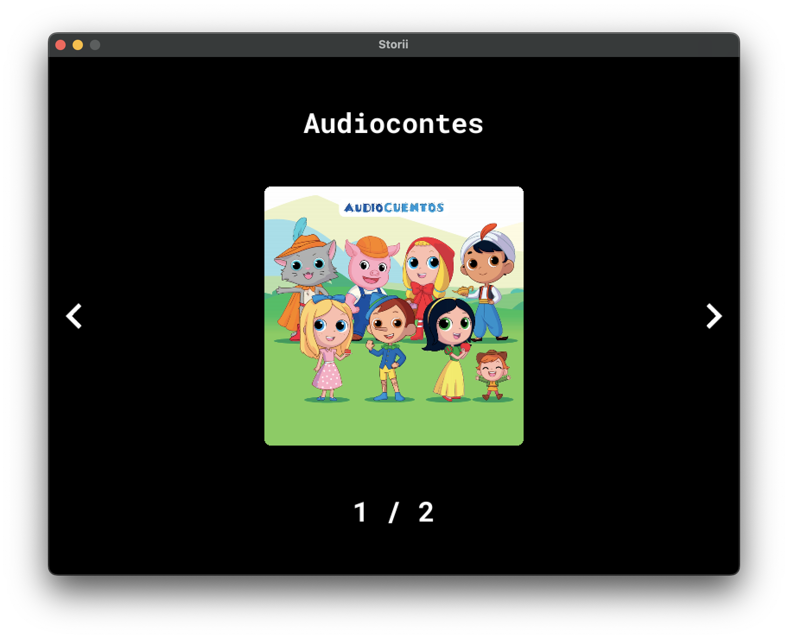
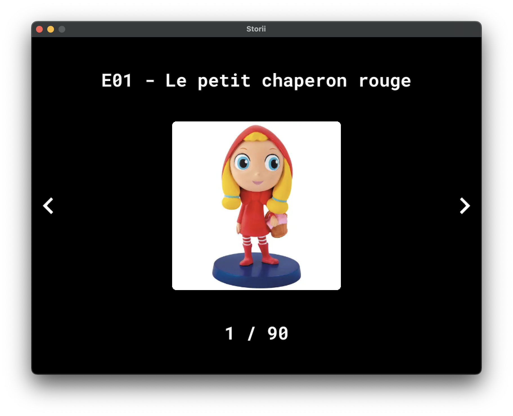
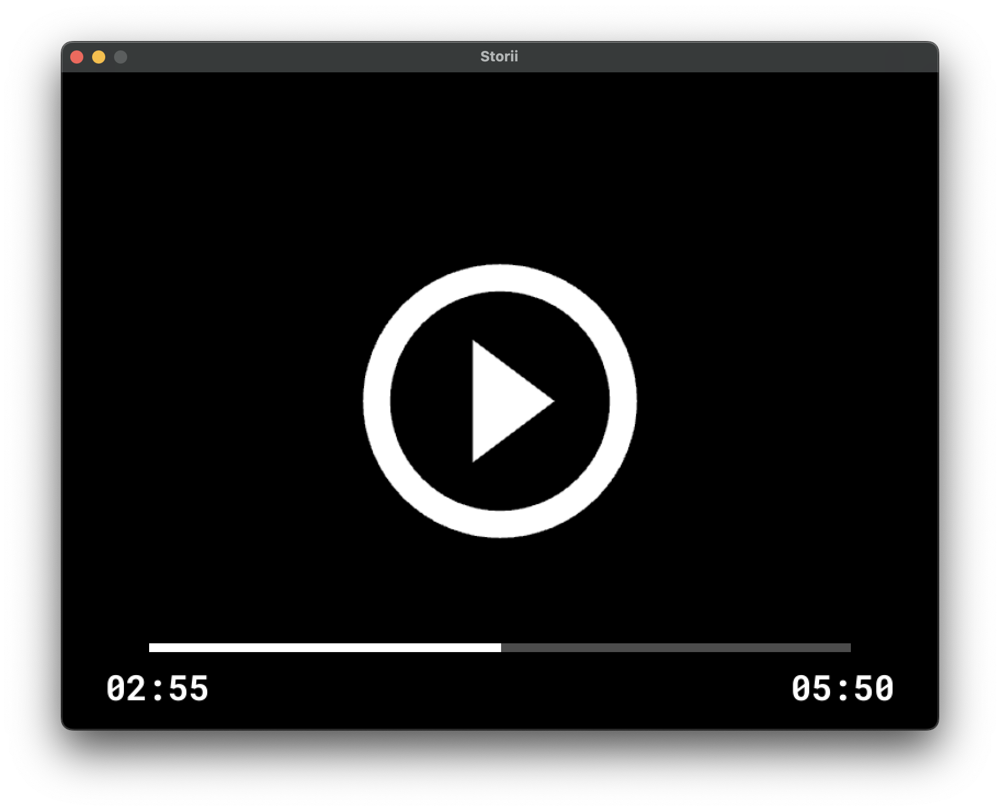

# 🎵 Storiies

A **simple and intuitive** children-friendly MP3 player designed specifically for kids on muOS devices. 🎮👶

## ✨ Features

- 🗂️ **Simple browsing** of albums and tracks - designed for easy kid navigation
- ▶️ **Easy play/pause** audio with simple seek controls
- 🎨 **Clean, kid-friendly interface** with large buttons and clear visuals
- 💾 **Dynamic story loading** from SD card
- 👶 **Child-focused design** - no complex menus or confusing options

## 📱 Screens

### 📚 Albums View


**Controls:**

| Button | Action |
|--------|--------|
| ⬅️➡️ | Navigate between albums |
| ⬆️⬇️ | Jump 10 albums at a time |
| 🅰️ | Select album and go to tracks view |

### 🎵 Tracks View


**Controls:**

| Button | Action |
|--------|--------|
| ⬅️➡️ | Navigate between tracks |
| ⬆️⬇️ | Jump 10 tracks at a time |
| 🅰️ | Select track and start playing |
| 🅱️ | Go back to albums view |

### ▶️ Player View


**Controls:**

| Button | Action |
|--------|--------|
| 🅰️ | Play/Pause |
| ⬅️➡️ | Seek backward/forward |
| 🅱️ | Stop and go back to tracks view |

**Features:**
- 🌙 **Dimmable Screen**: The screen automatically dims after a period of inactivity so children won't look at the screen too much while listening to stories. Touch any button to brighten the screen again.

## 🚀 Installation

To install storiies, follow these steps:

1. 📥 Download the latest release from the [Releases page](https://github.com/pcorbel/storiies/releases)
2. 📁 Move the downloaded file to the `/mnt/mmc/MUOS/ARCHIVE` folder
3. 📦 Open Archive Manager and select the file
4. ✅ After extraction, you'll find an entry called "Storiies" in the Applications section

## 📚 Adding Your Storiies

### 🛠️ Simple Setup (Perfect for Parents!)
1. 📂 Add your album folders inside `/MUOS/application/Storiies/storiies/` on your SD card
2. 📋 Each album folder should contain:
   - 🎵 MP3 audio files
   - 🖼️ PNG/JPG cover images (optional)

*The interface is designed to be so simple that even young children can use it independently!* 👶✨

### 📁 Example Structure
```
SD Card/
└── MUOS/
    └── application/
        └── Storiies/
            └── storiies/
                ├── Disney/
                │   ├── E001 - Le Roi Lion.mp3
                │   ├── E001 - Le Roi Lion.png
                │   ├── E002 - Le Livre de la Jungle.mp3
                │   └── E002 - Le Livre de la Jungle.png
                └── My Album/
                    ├── Track 1.mp3
                    └── Track 1.png
```


